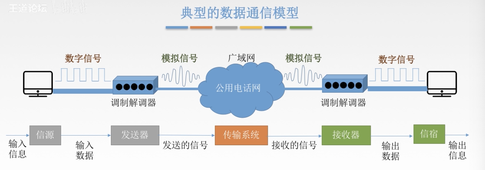

# 计算机网络基础Chapter-2, 物理层

## 1. 通信基础

**物理层基本概念**

- 物理层解决如何在连接各种计算机的传输媒体上**传输数据比特流**, 而不是指具体的传输媒体
- 主要任务: 确定与传输媒体接口有关的一些特性
- 机械特性:
- 电气特性:
- 功能特性:

**数据通信基础**

- 数据: 传送信息的实体, 通常是有意义的符号序列
- 信号: 数据的电气/电磁的表现, 是数据在传输过程中的存在形式
  - 数字信号: 代表消息的参数取值是离散的
  - 模拟信号: 代表消息的参数取值是连续的 (正弦波)
- 信源: 产生和发送数据的源头
- 信宿: 接收数据的终点
- 信道: 
  - 按传输信号分类:
  - 按
- 三种通信方式:
  - 单工通信

## 2. 两个公式

## 3. 看图说话 

## 4. 传输介质 

## 5. 物理层设备
